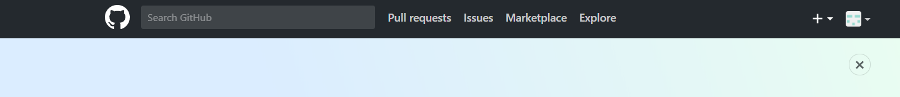
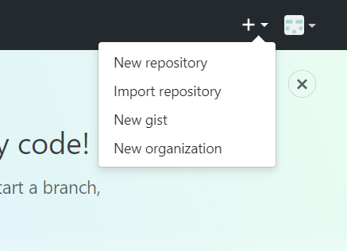
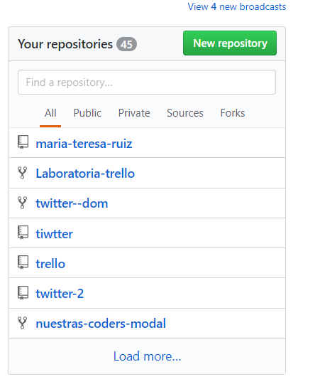
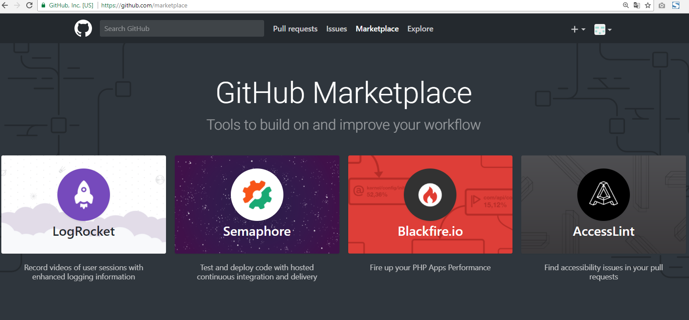
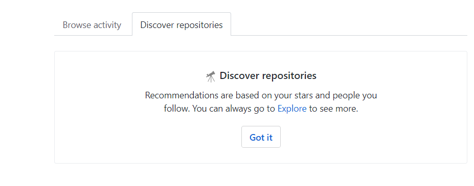
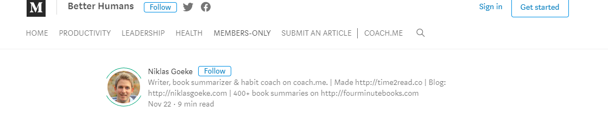
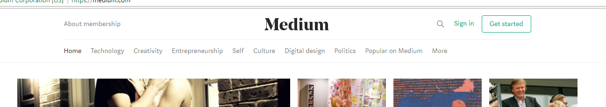
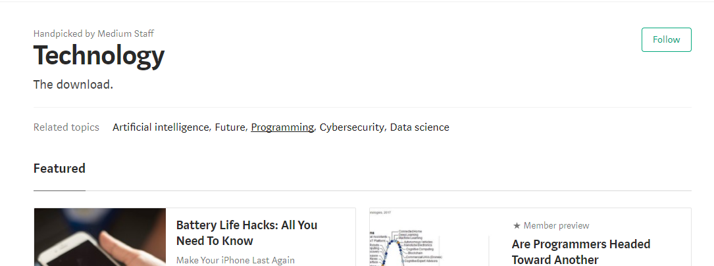
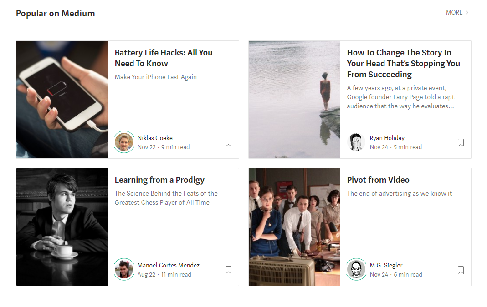
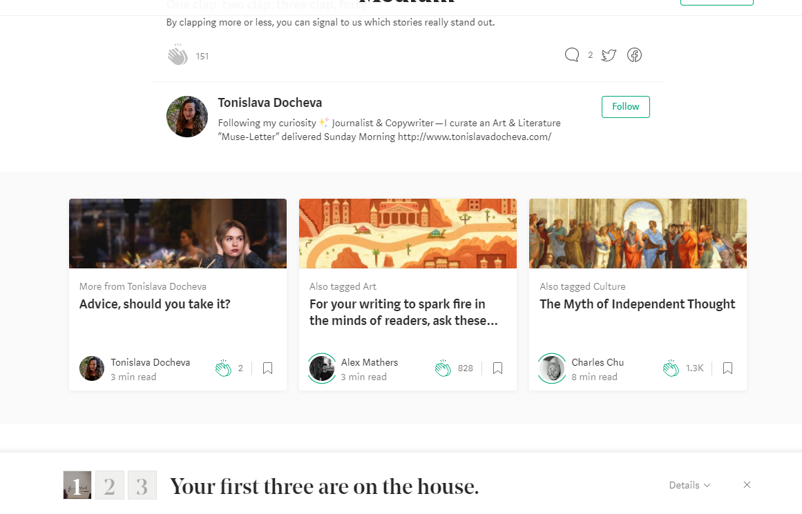

# RETO 2

***

Identifica los elementos de navegación en los siguientes sites:

## Breather

1. Navegación GLOBAL

  

  

2. Navegación LOCAL

3. Navegación FACETADA

  

4. Navegación FILTRADA

  

  

5. Navegación INLINE

  

## GitHub

1. Navegación GLOBAL

  

2. Navegación LOCAL

  

  

  

3. Navegación FACETADA

  

4. Navegación FILTRADA

5. Navegación CONTEXTUAL

  

## Medium

1. Navegación GLOBAL

  

2. Navegación LOCAL

  

3. Navegación FACETADA

  

  

4. Navegación FILTRADA

5. Navegación CONTEXTUAL

  

  
